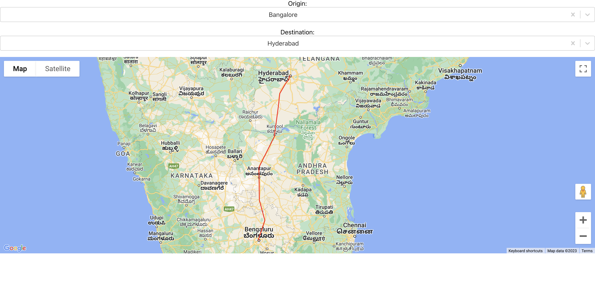

## Update google api key

Update google api key under public/index.html `<google maps key>`

## Available Scripts

In the project directory, you can run:

### `npm start`

Runs the app in the development mode.\
Open [http://localhost:3000](http://localhost:3000) to view it in your browser.

Test screen shot:

